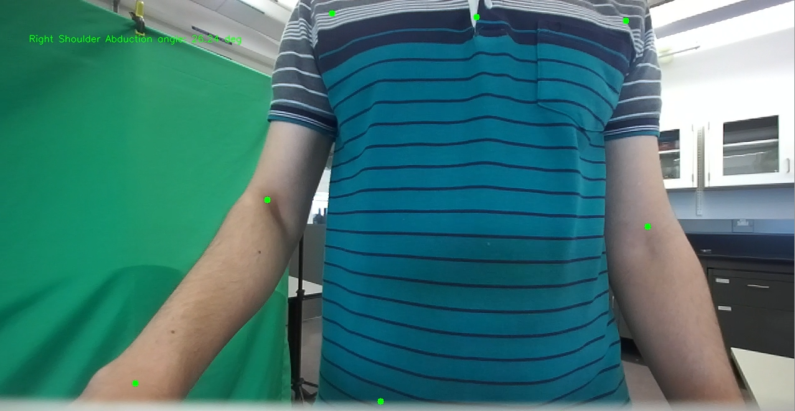

# ZED Pose Package

This repository contains a ROS2 package designed for working with the **ZED camera** by StereoLabs, providing **computer vision-based pose estimation** and **data logging capabilities**. The package includes two primary nodes:

1. **`zed_pose` Node** – Handles computer vision tasks such as body tracking and angle calculation.
2. **`pose_logger` Node** – Logs pose, force/torque, and odometry data to CSV files for further analysis.

<p align="center">
  
</p>


---

## Features

### `zed_pose` Node:
- Captures and processes images from the ZED 2i camera.
- Estimates human pose using **StereoLabs Body Tracking API**.
- Calculates 2D and 3D angles for the right and left arms/torso.
- Publishes processed images and angle data.
- Supports configurable **camera view (left/right)** and **body format (BODY_18, BODY_34, BODY_38)**.

### `pose_logger` Node:
- Subscribes to pose, force/torque, and odometry topics.
- Logs the data into structured CSV files with timestamping.
- Handles quaternion to Euler angle conversion for odometry.

---

## Installation

1. **Clone the Repository:**
   ```bash
   git clone https://github.com/mahdichalaki/zed_pose
   cd zed_pose

2. **Install Dependencies:** Ensure you have the necessary ROS2 and StereoLabs ZED SDK installed:
	```bash
	sudo apt update
	sudo apt install ros-humble-rclpy ros-humble-cv-bridge ros-humble-sensor-msgs ros-humble-nav-msgs ros-humble-std-msgs

3. **Build the Package:**
	```bash
	colcon build --packages-select zed_pose
	source install/setup.bash
	
---

## Usage

### Launching the Nodes

To start the `zed_pose` and `pose_logger` nodes:

1. **Start the ZED Pose Node:**
   ```bash
   ros2 run zed_pose zed_pose_node --ros-args -p body_format:=BODY_18 -p camera_side:=left -p publish_frequency:=10.0

2. **Start the Pose Logger Node:**
	```bash
	ros2 run zed_pose pose_logger --ros-args -p file_suffix:=test_run
	
---

### Configuration Parameters

#### `zed_pose` Node Parameters:

| Parameter          | Type   | Default   | Description                                   |
|-------------------|--------|-----------|-----------------------------------------------|
| `body_format`      | String | `BODY_18`  | Body format: `BODY_18`, `BODY_34`, `BODY_38`  |
| `camera_side`      | String | `left`     | Camera view: `left` or `right`                |
| `publish_frequency`| Float  | `10.0`     | Frequency of publishing data (Hz)             |

#### `pose_logger` Node Parameters:

| Parameter    | Type   | Default | Description                         |
|--------------|--------|---------|-------------------------------------|
| `file_suffix`| String | `''`    | Suffix for log file naming          |

---

## Published Topics

### `zed_pose` Node:

| Topic                      | Message Type                | Description                          |
|----------------------------|-----------------------------|--------------------------------------|
| `zed_pose/left_image`       | `sensor_msgs/Image`          | Processed left camera image         |
| `zed_pose/right_image`      | `sensor_msgs/Image`          | Processed right camera image        |
| `angles`                    | `std_msgs/Float32MultiArray` | Published angles (4 values)          |

### `pose_logger` Node:

| Topic              | Message Type                  | Description                            |
|--------------------|-------------------------------|----------------------------------------|
| `angles`            | `std_msgs/Float32MultiArray`   | Logs right/left arm and torso angles   |
| `/calibrated_wrench`| `geometry_msgs/WrenchStamped` | Logs force/torque sensor data          |
| `/odom`             | `nav_msgs/Odometry`           | Logs odometry data (x, y, theta)       |

---

## Data Logging

The `pose_logger` node logs data into three separate CSV files:

1. **Angles Data (`angles_log_<suffix>.csv`):**
   - `timestamp, right_elbow_angle, right_torso_angle, left_elbow_angle, left_torso_angle`

2. **Force/Torque Data (`force_log_<suffix>.csv`):**
   - `timestamp, force_x, force_y, force_z, torque_x, torque_y, torque_z`

3. **Odometry Data (`odom_log_<suffix>.csv`):**
   - `timestamp, position_x, position_y, theta`

---

## License

This project is licensed under the MIT License.


